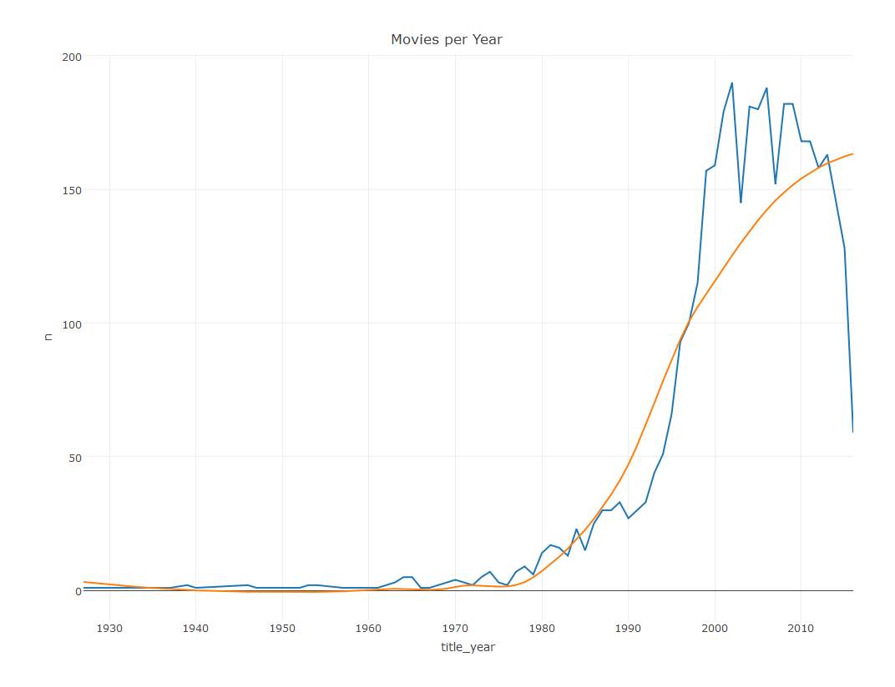
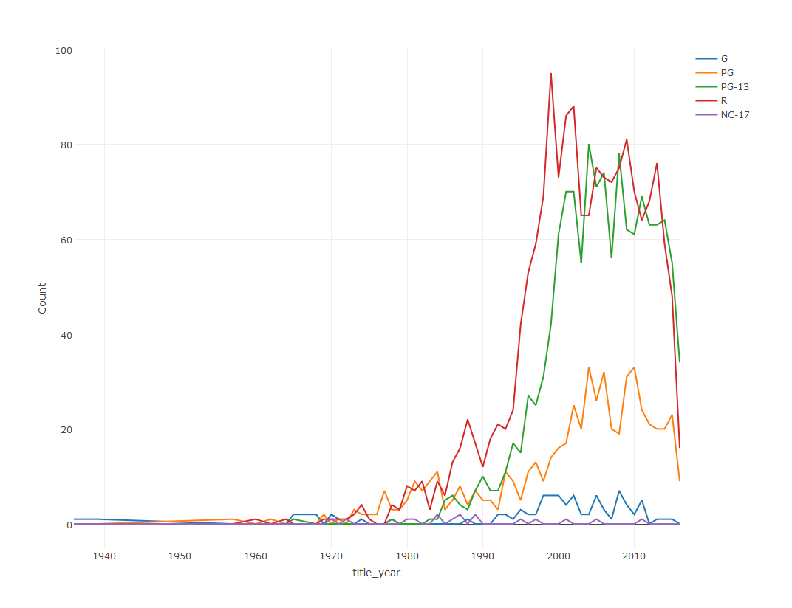

IMDB Movie Analysis
================

組員
----

陳玉菡

分析議題背景
------------

現在的電影越出越多，出續集的速度也非常的快，常常續集每隔一年就能產出。有些電影會以強大的演員卡司陣容，或強大的特效技術等，來吸引更多的消費者願意掏錢去電影院觀看。 IMDB、Metacritic、Rotten Tomato，皆為國外廣為人知的電影資訊與評論網站，但是其性質及使用客群並不相同。IMDB大多皆為一般網民評分，較少專業影評人評分；Metacritic的評分則是以一群專業影評人給分的加權平均數計算；Rotten Tomato則介於兩者之間，大量採用了各大報章雜誌的評論, 不論是頂尖的專業影評或是路邊小報非專業人士的影評, 都被拿來作為平均計分的標準，以Tomatometer反映喜歡某指定影片的人的百分比。

分析動機
--------

想藉由IMDB網站提供的電影資料來分析電影類型及內容的趨勢，IMDB score與電影預算、導演、演員陣容、票房等之間的關係，還有Metascore網站給予的評分與IMDB網站給的評分是否有很大的差異？

使用資料
--------

載入IMDB 5000 movies dataset (source:<https://www.kaggle.com/deepmatrix/imdb-5000-movie-dataset>) 並去掉有NA值的整筆電影資料

``` r
library(readr)
```

    ## Warning: package 'readr' was built under R version 3.3.3

``` r
movie_metadata <- read_csv("~/GitHub/CGUIM_BigData_HW6-b0322020/movie_metadata.csv")
```

    ## Parsed with column specification:
    ## cols(
    ##   .default = col_integer(),
    ##   color = col_character(),
    ##   director_name = col_character(),
    ##   actor_2_name = col_character(),
    ##   genres = col_character(),
    ##   actor_1_name = col_character(),
    ##   movie_title = col_character(),
    ##   actor_3_name = col_character(),
    ##   plot_keywords = col_character(),
    ##   movie_imdb_link = col_character(),
    ##   language = col_character(),
    ##   country = col_character(),
    ##   content_rating = col_character(),
    ##   imdb_score = col_double(),
    ##   aspect_ratio = col_double()
    ## )

    ## See spec(...) for full column specifications.

    ## Warning in rbind(names(probs), probs_f): number of columns of result is not
    ## a multiple of vector length (arg 1)

    ## Warning: 4 parsing failures.
    ## row # A tibble: 4 x 5 col     row    col   expected      actual expected   <int>  <chr>      <chr>       <chr> actual 1  2324 budget an integer  2400000000 file 2  2989 budget an integer 12215500000 row 3  3006 budget an integer  2500000000 col 4  3860 budget an integer  4200000000 expected # ... with 1 more variables: file <chr>

``` r
movie_metadata<-na.omit(movie_metadata)
```

藉由movie\_metadata的movie\_imdb\_link，抓取每筆電影在IMDB網站上的最新IMDB rating、rating的人數、User review的人數、Critic review的人數、Metascore 的分數

``` r
library(rvest)
```

    ## Warning: package 'rvest' was built under R version 3.3.3

    ## Loading required package: xml2

    ## Warning: package 'xml2' was built under R version 3.3.3

    ## 
    ## Attaching package: 'rvest'

    ## The following object is masked from 'package:readr':
    ## 
    ##     guess_encoding

``` r
imdb_rating<-c()
imdb_ratingCount<-c()
num_user_reviews<-c()
num_critic_reviews<-c()
metascore_rating<-c()

for(i in 1:3752){
  movie<-read_html(movie_metadata$movie_imdb_link[i])
  imdb_rating[[i]]<-movie%>%html_nodes("strong span")%>%html_text()%>%as.numeric()
  imdb_ratingCount[i]<-movie%>%html_nodes(".imdbRating")%>%html_nodes(".small")%>%html_text()
  if(grepl(",",imdb_ratingCount[i])){
    imdb_ratingCount[[i]]<-gsub(",","",imdb_ratingCount[i])
  }
  if(grepl("metacritic",movie%>%html_nodes("#title-overview-widget")%>%html_text())){
    metascore_rating[[i]]<-movie%>%html_nodes("#title-overview-widget")%>%html_node(".metacriticScore")%>%html_text()%>%as.numeric()
    u<-movie%>%html_nodes(".titleReviewBarItem")%>%html_nodes("a")%>%html_text()
  num_user_reviews[[i]]<-u[4]
  c<-movie%>%html_nodes(".titleReviewBarItem")%>%html_nodes("a")%>%html_text()
  num_critic_reviews[[i]]<-c[5]
  }
  else{
    metascore_rating[[i]]<-NA
    u<-movie%>%html_nodes(".titleReviewBarItem")%>%html_nodes("a")%>%html_text()
    num_user_reviews[[i]]<-u[1]
    c<-movie%>%html_nodes(".titleReviewBarItem")%>%html_nodes("a")%>%html_text()
    num_critic_reviews[[i]]<-c[2]
  }
  num_user_reviews[[i]]<-gsub(' user',"",num_user_reviews[i])
  if(grepl(",",num_user_reviews[i])){
    num_user_reviews[[i]]<-gsub(',',"",num_user_reviews[i])
  }
  num_critic_reviews[[i]]<-gsub(' critic',"",num_critic_reviews[i])
  if(grepl(",",num_critic_reviews[i])){
    num_critic_reviews[[i]]<-gsub(',',"",num_critic_reviews[i])
  }
}
```

資料處理與清洗
--------------

將抓取到的資料更新或新增欄位到movie\_metadata drop掉aspect\_ratio(電影寬高比)欄位

``` r
movie_metadata$imdb_score<-imdb_rating
movie_metadata$num_voted_users<-as.numeric(imdb_ratingCount)
movie_metadata$num_critic_for_reviews<-as.numeric(num_critic_reviews)
movie_metadata$num_user_for_reviews<-as.numeric(num_user_reviews)
movie_metadata$metascore<-as.numeric(metascore_rating)
movie_metadata<-movie_metadata[ , !(names(movie_metadata) %in% "aspect_ratio")]
write.csv(movie_metadata, file = "~/GitHub/CGUIM_BigData_HW6-b0322020/movie_metadata_latest.csv")
```

清洗content rating，將舊制的分級重新歸類：X rated movie歸類為NC-17，GP和M歸類為PG (source: <https://en.wikipedia.org/wiki/Motion_Picture_Association_of_America_film_rating_system#From_M_to_GP_to_PG>) 最後將除unrated, not rated, passed, Approved的電影改為NA值

``` r
movie_metadata$content_rating[movie_metadata$content_rating == "X"] <- "NC-17"
movie_metadata$content_rating[movie_metadata$content_rating == "GP"] <- "PG"
movie_metadata$content_rating[movie_metadata$content_rating == "M"] <- "PG"
movie_metadata$content_rating[movie_metadata$content_rating == "Not Rated"] <- NA
movie_metadata$content_rating[movie_metadata$content_rating == "Unrated"] <- NA
movie_metadata$content_rating[movie_metadata$content_rating == "Passed"] <- NA
movie_metadata$content_rating[movie_metadata$content_rating == "Approved"] <- NA
```

探索式資料分析
--------------

在此dataset裡，從每年電影數量趨勢圖中，可以看出2002年的電影數量最多，再來是2006年

``` r
library(plotly)
```

    ## Loading required package: ggplot2

    ## Warning: package 'ggplot2' was built under R version 3.3.3

    ## 
    ## Attaching package: 'plotly'

    ## The following object is masked from 'package:ggplot2':
    ## 
    ##     last_plot

    ## The following object is masked from 'package:stats':
    ## 
    ##     filter

    ## The following object is masked from 'package:graphics':
    ## 
    ##     layout

``` r
temp<-movie_metadata %>% select(movie_title,title_year)
p<-temp %>% group_by(title_year) %>% summarise(n=n())%>%plot_ly(x = ~title_year, y = ~n, type = 'scatter', mode = 'lines')
export(p%>%add_trace( x =~title_year, y = ~fitted(loess(n ~ as.numeric(title_year))))%>%layout(title = "Movies per Year",showlegend = FALSE))
```



分析IMDB Score和電影預算、總收益、電影Facebook 粉絲人數、導演人氣(導演Facebook粉絲人數)、演員陣容人氣(演員Total Facebook粉絲人數)是否有相關性 由分析結果可看出皆呈現低度正相關，代表他們之間並無存在很大的關聯性 (-0.3<sub>0.3為低度相關；-0.3</sub>-0.6或0.3~0.6為中度相關；-0.6以下或0.6以上為高度相關)

``` r
library(dplyr)
```

    ## Warning: package 'dplyr' was built under R version 3.3.3

    ## 
    ## Attaching package: 'dplyr'

    ## The following objects are masked from 'package:stats':
    ## 
    ##     filter, lag

    ## The following objects are masked from 'package:base':
    ## 
    ##     intersect, setdiff, setequal, union

``` r
cor_money<-summarise(movie_metadata,"cor_budget"=cor(movie_metadata$imdb_score,movie_metadata$budget),"cor_gross"=cor(movie_metadata$imdb_score,movie_metadata$gross))
cor_likes<-summarise(movie_metadata,"cor_movie_facebook_likes"=cor(movie_metadata$imdb_score,movie_metadata$movie_facebook_likes), "cor_director_facebook_likes"=cor(movie_metadata$imdb_score,movie_metadata$director_facebook_likes),"cor_cast_facebook_likes"=cor(movie_metadata$imdb_score,movie_metadata$cast_total_facebook_likes))
knitr::kable(data.frame(cor_money))
```

|  cor\_budget|  cor\_gross|
|------------:|-----------:|
|    -0.004201|   0.0012054|

``` r
knitr::kable(data.frame(cor_likes))
```

|  cor\_movie\_facebook\_likes|  cor\_director\_facebook\_likes|  cor\_cast\_facebook\_likes|
|----------------------------:|-------------------------------:|---------------------------:|
|                    0.0026799|                       0.0109876|                   0.0052559|

分析電影分級的分布 (G: General Audience, PG: Parental Guidance Suggested (mainly for under 10's), PG-13: Parental Guidance Suggested for children under 13, R: Under 17 not admitted without parent or guardian, NC-17: Under 17 not admitted) 從各電影分級的個數的表格中，可以發現R rated movie數量最多

``` r
content_rating_total<-table(movie_metadata$content_rating)
content_rating_total<-content_rating_total[c(1,3,4,5,2)]
knitr::kable(t(as.matrix(content_rating_total)))
```

|    G|   PG|  PG-13|     R|  NC-17|
|----:|----:|------:|-----:|------:|
|   87|  569|   1307|  1697|     16|

由每年各電影分級的趨勢圖可以發現R和PG-13級的電影有大幅上升的趨勢

``` r
library(tidyr)
```

    ## Warning: package 'tidyr' was built under R version 3.3.3

``` r
content_rating_year<-na.omit(movie_metadata)%>%group_by(title_year,content_rating)%>%summarise(n_content_rating=n())
content_rating_year2<-spread(content_rating_year,content_rating,n_content_rating)
content_rating_year2[is.na(content_rating_year2)]<-0
export(plot_ly(content_rating_year2, x = ~title_year, y = ~G, type = 'scatter', mode='line', name = 'G') %>%
    add_trace(y = ~PG, name = 'PG') %>%
    add_trace(y= ~`PG-13`, name='PG-13')%>%
    add_trace(y= ~R, name='R')%>%
    add_trace(y= ~`NC-17`, name='NC-17')%>%
    layout(yaxis = list(title = 'Count') ))
```

    ## A line object has been specified, but lines is not in the mode
    ## Adding lines to the mode...
    ## A line object has been specified, but lines is not in the mode
    ## Adding lines to the mode...
    ## A line object has been specified, but lines is not in the mode
    ## Adding lines to the mode...
    ## A line object has been specified, but lines is not in the mode
    ## Adding lines to the mode...
    ## A line object has been specified, but lines is not in the mode
    ## Adding lines to the mode...
    ## A line object has been specified, but lines is not in the mode
    ## Adding lines to the mode...
    ## A line object has been specified, but lines is not in the mode
    ## Adding lines to the mode...
    ## A line object has been specified, but lines is not in the mode
    ## Adding lines to the mode...
    ## A line object has been specified, but lines is not in the mode
    ## Adding lines to the mode...
    ## A line object has been specified, but lines is not in the mode
    ## Adding lines to the mode...
    ## A line object has been specified, but lines is not in the mode
    ## Adding lines to the mode...
    ## A line object has been specified, but lines is not in the mode
    ## Adding lines to the mode...
    ## A line object has been specified, but lines is not in the mode
    ## Adding lines to the mode...
    ## A line object has been specified, but lines is not in the mode
    ## Adding lines to the mode...
    ## A line object has been specified, but lines is not in the mode
    ## Adding lines to the mode...



期末專題分析規劃
----------------

1.  Metacritic Score 和 IMDB Score 是否有很大的差異性
2.  分析在電影分級中，哪一分級的IMDB score最高
3.  哪些導演拍的電影得到的平均IMDB score比較高
4.  哪些演員所拍的電影是票房保證
5.  哪些演員所拍的電影平均IMDB score/Metacritic score比較高
6.  每年的電影平均IMDB Score和Metacritic Score趨勢
7.  哪種類型和內容的電影越來越多？觀眾是否也買單
8.  電影總收益有無增加的趨勢
